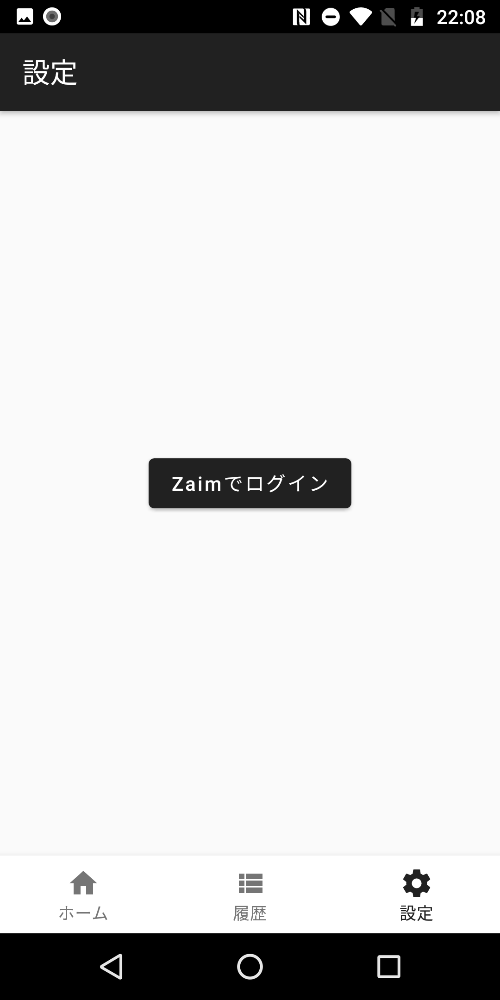
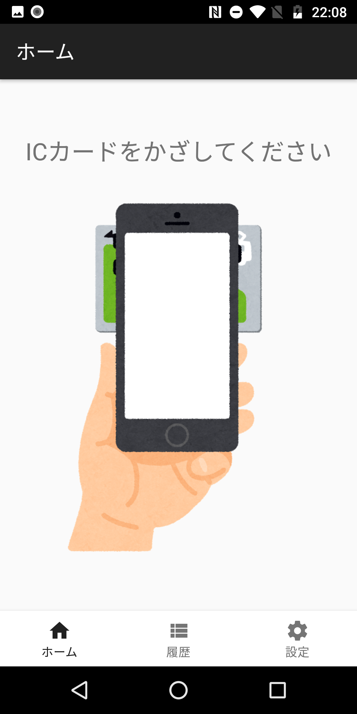
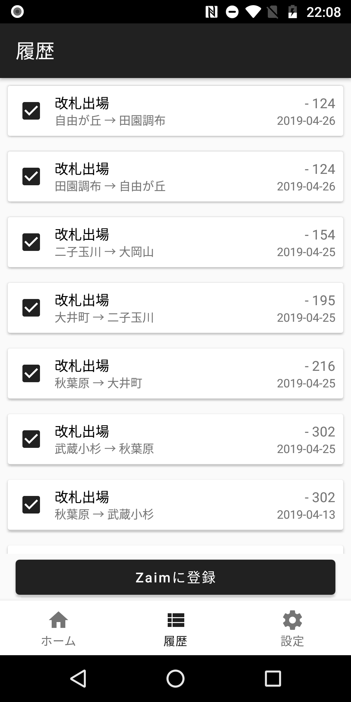

# FeliCaZ

Save history of FeliCa (Suica, PASMO) to Zaim.

## Usage

### Login with Zaim



### Read FeliCa card (Suica, PASMO)



### Save history to Zaim.



## Debug run

```bash
$ ./gradlew assembleDebug
$ adb install -r ./app/build/outputs/apk/debug/app-debug.apk
$ adb shell monkey -p work.deka.felicaz -c android.intent.category.LAUNCHER 1
```
